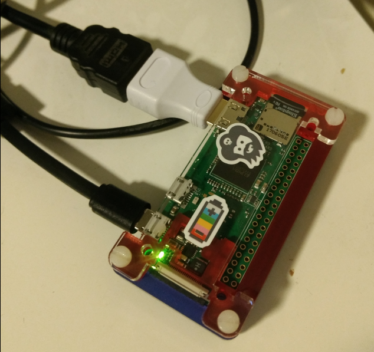
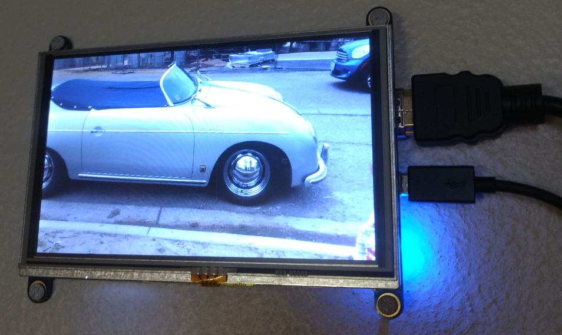

# picturepi
Python programs to discover and display a dynamic picture gallery, designed for a Raspberry Pi but adaptable to other environments.

###### Setup:

I am using Python 3.5.3 on a Raspberry Pi Zero W running Rasbian GNU/Linux 9 Stretch Desktop:

https://www.raspberrypi.org/downloads/raspbian/

I suggest buying the Pimoroni Pi Zero W Starter Kit, it has everything outside of the HDMI cable and the Display for this project.  

https://www.adafruit.com/product/3480

I am using the HDMI 7 800x480 Display:

https://www.adafruit.com/product/2407

  Here is the command I used to install the python dependencies.  This works on Rasbian, and should work on Debian, Mint, Ubuntu, and other Debian derivitiaves.  

> apt install python3-pil python3-pil.imagetk

I have provided a simple shell script (run-example.sh) to run both programs.  The gather_files.py program will find any image files in the directory that you specify and will add this to the file listing to be used by the gallery.py program.  I am running run.sh as a system cron, so it will start at reboot.  Here is an example of how root's crontab could look like:

> @reboot /home/pi/picturepi/run-picturepi.sh > /home/pi/picturepi/picturepi-output.log 2>&1 

For me, I am reloading my image database through gather_files.py nightly, and referencing my NAS over my LAN to capture my ever changing picture library.  Thus, my picture gallery always is up to date with the latest set of pictures.

Enjoy!

